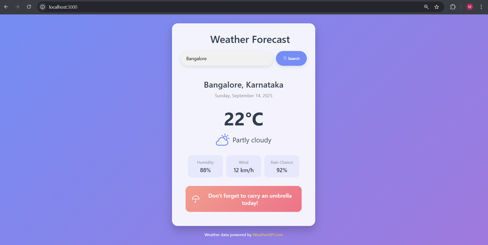
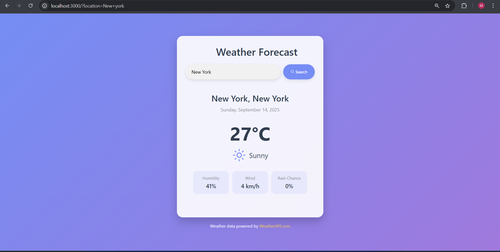
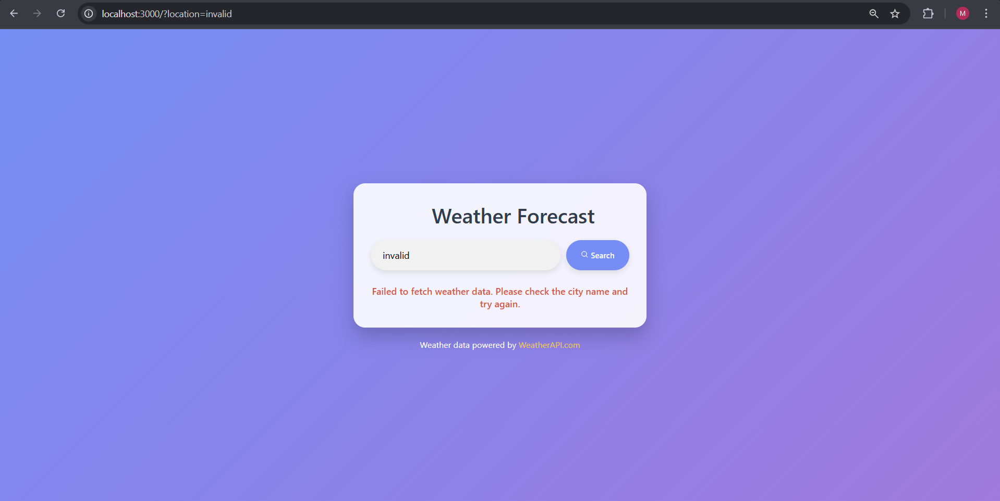

## 📸 Screenshots





# 🌦️ Weather Forecast App

A simple Node.js + Express weather application that shows the **current weather and 5-day forecast** for any city using the [WeatherAPI](https://www.weatherapi.com/).

## 🚀 Features
- 🌍 Search weather by city name  
- 🌡️ Shows temperature, humidity, wind speed, and rain chance  
- 🌤️ Dynamic weather icons for sunny, cloudy, rainy, etc.  
- ☔ Umbrella alert if rain probability is high  
- 📍 Default location set to **Bangalore**  
- 🛠️ Built with **Express, EJS, Axios, and dotenv**

---

## 🛠️ Tech Stack
- [Node.js](https://nodejs.org/)
- [Express.js](https://expressjs.com/)
- [EJS](https://ejs.co/)
- [Axios](https://axios-http.com/)
- [dotenv](https://github.com/motdotla/dotenv)
- [WeatherAPI](https://www.weatherapi.com/)

---

## 📂 Project Structure
```
project/
├── public/           # Static assets (CSS, images)
├── views/            # EJS templates
│   └── index.ejs
├── .env              # API key and environment variables
├── index.js          # Main server file
├── package.json
└── README.md
```


## 🔑 Setup & Installation

1. Clone the repository
git clone https://github.com/your-username/weather-forecast-app.git
cd weather-forecast-app

2.Install dependencies
npm install

3.Create a .env file
API_KEY=your_weatherapi_key_here

4.Start the server
node index.js

Open in browser
http://localhost:3000

